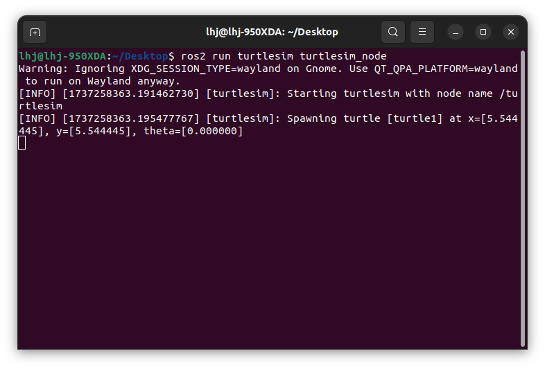
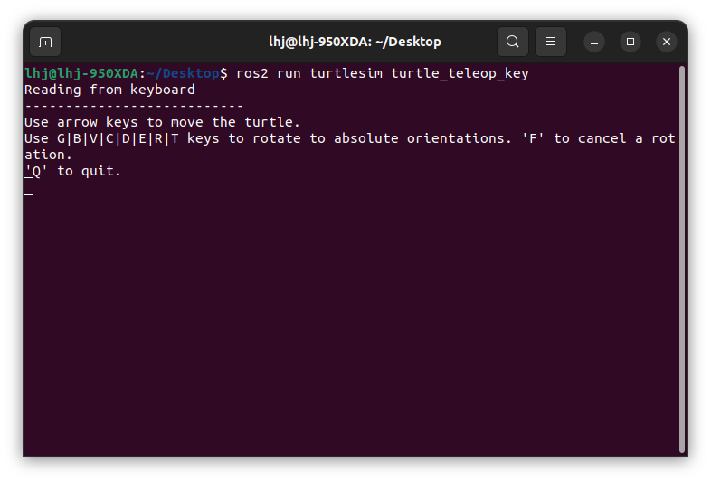
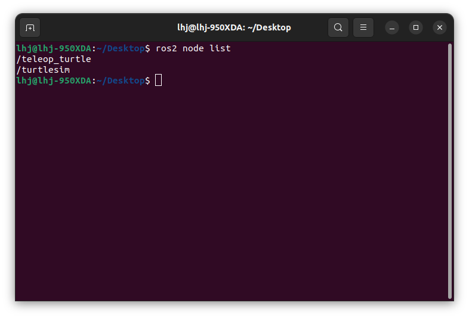
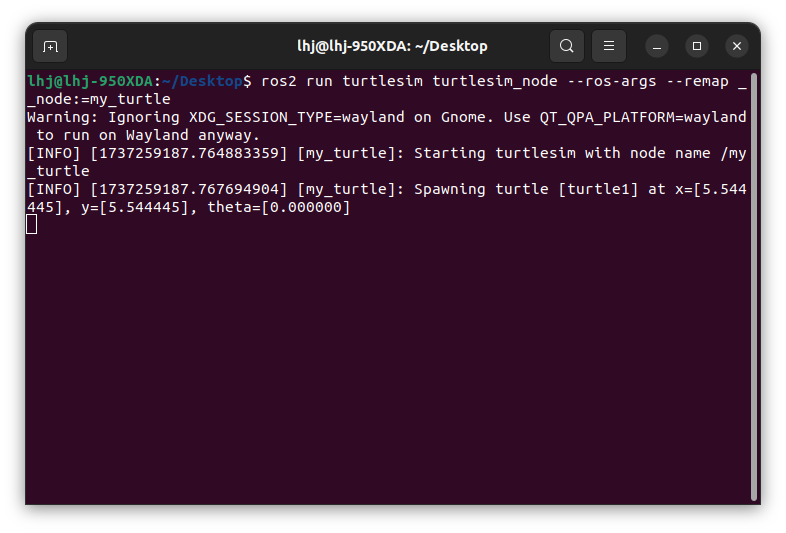
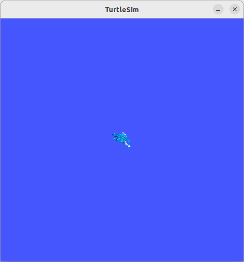
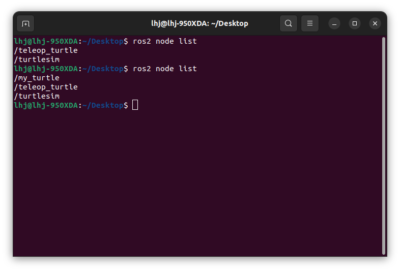
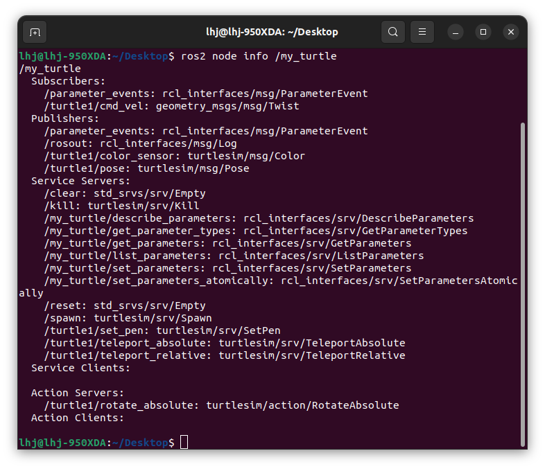

# ✨ Linux & ROS 2

## ⚙️ Environment
### <U>[Rufus & Dual Boot](https://webnautes.tistory.com/2119)</U>
- Rufus
- Linux(Ubuntu)
- BIOS boot setting
### <U>[Ubuntu](https://webnautes.tistory.com/2120)</U>
- Ubuntu setting
### <U>[ROS 2](https://velog.io/@i_robo_u/%ED%98%84%EC%A7%81%EC%9E%90%EA%B0%80-%EC%95%8C%EB%A0%A4%EC%A3%BC%EB%8A%94-ROS2-%EB%AA%85%EB%A0%B9%EC%96%B4-%EB%8F%84%EA%B5%ACCommand-Line-interface-tools-1)</U>
- turtlesim
- rqt
### Summary
1. Rufus : Linux(Ubuntu) > USB
2. BIOS Setting
3. Ubunt Basic Setting

## ✅ Nodes
</img>

### 1. run
```bash
ros2 run <package name> <executable name>
```
```bash
ros2 run turtlesim turtlesim_node
```

</img>

### 2. node list
```bash
ros2 node list
```

</img>
</img>
</img>

#### 2.1 remapping
```bash
ros2 run turtlesim turtlesim_node --ros-args --remap __node:=my_turtle
```

</img>
</img>
</img>

### 3. node info
```bash
ros2 node info /my_turtle
```

</img>

### Summary
1. node is a fundamental ROS 2 element that serves a single, modular purpose in a robotics system.
2. We utilized nodes created in the *turtlesim* package by running the executalbes *turtlesim* and *turtlesim_key*.
3. We learned how to use *ros2 noed list* to discover active node names and *ros2 node info* to introspect a single node. These tools are vital to understanding the flow of data in a complex, real-world robot system.

## ✅ Topic
</img>

## ✅ Services
</img>

## ✅ Parameters

## ✅ Actions
</img>

## ✅ Colcon
> Concept of Libraries for Compilers Installation

