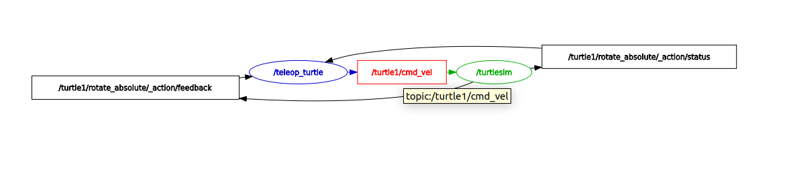

# 1. Topic

## 1.1 Topic conccept

- Topic : publish + subscribe (메시지 버스)   
-> 이는 다음과 같이 rqt-graph로 확인가능.


<center>fig 1. Topic </center>   


<center>fig 1.2 turtle Topics rqt-graph</center>

## 1.2 Topic command

### - topic list
``` Bash
# 주제(이름)
$ ros2 topic list
#-----------------
/parameter_events
/rosout
/turtle1/cmd_vel
/turtle1/color_sensor
/turtle1/pose
/turtle2/cmd_vel
/turtle2/color_sensor
/turtle2/pose

# 주제 + 목록 (message_type)
$ ros2 topic list -t
#-------------------
/parameter_events [rcl_interfaces/msg/ParameterEvent]
/rosout [rcl_interfaces/msg/Log]
/turtle1/cmd_vel [geometry_msgs/msg/Twist]
/turtle1/color_sensor [turtlesim/msg/Color]
/turtle1/pose [turtlesim/msg/Pose]
/turtle2/cmd_vel [geometry_msgs/msg/Twist]
/turtle2/color_sensor [turtlesim/msg/Color]
/turtle2/pose [turtlesim/msg/Pose]

# message type임을 보여줌
$ ros2 topic type /turtle1/pose
#------------------------------
turtlesim/msg/Pose

<<<<<<< HEAD
# publish & subscribe 구분해서 보기
=======
# publish & subscribe 구분해서 보기 (service는 지원이 안됨.)
>>>>>>> joonmoHan
$ ros2 topic info /turtle1/pose
#------------------------------
Type: turtlesim/msg/Pose
Publisher count: 1
Subscription count: 0

<<<<<<< HEAD
# name + message type + info 한꺼번에 확인
=======
# name + message type + info 한꺼번에 확인 (topic만 지원됨.)
>>>>>>> joonmoHan
$ ros2 topic list -v
#--------------------
Published topics:
 * /parameter_events [rcl_interfaces/msg/ParameterEvent] 4 publishers
 * /rosout [rcl_interfaces/msg/Log] 4 publishers
 * /turtle1/cmd_vel [geometry_msgs/msg/Twist] 1 publisher
 * /turtle1/color_sensor [turtlesim/msg/Color] 1 publisher
 * /turtle1/pose [turtlesim/msg/Pose] 1 publisher
 * /turtle2/color_sensor [turtlesim/msg/Color] 1 publisher
 * /turtle2/pose [turtlesim/msg/Pose] 1 publisher

Subscribed topics:
 * /parameter_events [rcl_interfaces/msg/ParameterEvent] 3 subscribers
 * /turtle1/cmd_vel [geometry_msgs/msg/Twist] 1 subscriber
 * /turtle2/cmd_vel [geometry_msgs/msg/Twist] 1 subscriber

 # meesage type 세부 정보 확인
 $ ros2 interface show turtlesim/msg/Pose 
 #---------------------------------------
float32 x
float32 y
float32 theta

float32 linear_velocity
float32 angular_velocity

# turtl31/pose 라는 topic subscribe
$ ros2 topic echo /turtle1/pose
#------------------------------
# 지속적으로 현재 상태 및 위치를 publish
---
x: 5.127882957458496
y: 5.669435024261475
theta: 1.7422970533370972
linear_velocity: 0.0
angular_velocity: 0.0
---
...

# 사용가능한 topic list
$ ros2 topic list -t
#-------------------
/parameter_events [rcl_interfaces/msg/ParameterEvent]
/rosout [rcl_interfaces/msg/Log]
/turtle1/cmd_vel [geometry_msgs/msg/Twist]
/turtle1/color_sensor [turtlesim/msg/Color]
/turtle1/pose [turtlesim/msg/Pose]
/turtle2/cmd_vel [geometry_msgs/msg/Twist]
/turtle2/color_sensor [turtlesim/msg/Color]
/turtle2/pose [turtlesim/msg/Pose]
<<<<<<< HEAD
=======

# 명령어 기억이 안날때
$ ros2 topic -h
#---------------
usage: ros2 topic [-h] [--include-hidden-topics]
                  Call `ros2 topic <command> -h` for more detailed usage. ...

Various topic related sub-commands

options:
  -h, --help            show this help message and exit
  --include-hidden-topics
                        Consider hidden topics as well

Commands:
  bw     Display bandwidth used by topic
  delay  Display delay of topic from timestamp in header
  echo   Output messages from a topic
  find   Output a list of available topics of a given type
  hz     Print the average publishing rate to screen
  info   Print information about a topic
  list   Output a list of available topics
  pub    Publish a message to a topic
  type   Print a topic's type

  Call `ros2 topic <command> -h` for more detailed usage.

>>>>>>> joonmoHan
```

#### - topic pub


```bash
# topic publish
# -once, rate, hz 선택 default = 1hz
# <args> : data
$ ros2 topic pub -once (or rate <hz>)<topic_name> <msg_type> '<args>'
#-----------------------------------
```

- pub ex

```bash
$ ros2 topic pub /turtle1/cmd_vel geometry_msgs/msg/Twist "{linear: {x: 2.0, y: 0.0, z: 0.0}, angular: {x: 0.0, y: 0.0, z: 1.8}}"
```

<center>fig 1.3 pub ex</center>

#### - another command

```bash
$ ros2 topic hz <message_type>

$ ros2 topic bw <message_type>

$ ros2 topic find <topic_type>
```

# 2. Service

## 2.1 Service concept

- node간의 request & response
- client -request-> server
- server -response-> client
- response가 되어야만 data 호출


<center>fig 1.1 Service</center>    

## 2.2 service call

```bash
# call
$ ros2 service call <service_name> <service_type> <arg>
```

- call ex
```bash
# 선 지우기
$ ros2 service call /clear std_srvs/srv/Empty
#--------------------------------------------
requester: making request: std_srvs.srv.Empty_Request()

response:
std_srvs.srv.Empty_Response()
```

<center>fig 2.2 call ex</center>

# 3. Action

## 3.1 Action concept

- service 에서 feedback topic이 추가된 것 (Goal 달성까지)
Request
- client -service(send goal)-> server
- client -service(cancel goal)-> server
- client -service(get result)-> server
     
Respose 
- server -topic(feedback)-> client
- server -topic(status)-> client 


<center>fig 3.1 Action</center>

## 3.2 send_goal

```bash
# send_goal
ros2 action send_goal <action_name> <action_type> <values>
```
- send_goal ex
```bash
# <values> : yaml
$ ros2 action send_goal /turtle1/rotate_absolute turtlesim/action/RotateAbsolute "{theta: 1.57}"
#---------------------------------
Waiting for an action server to become available...
Sending goal:
     theta: 1.57

Goal accepted with ID: 3a08f9380d484811953ec9ed6b125af0

Result:
    delta: 2.128000020980835

Goal finished with status: SUCCEEDED
```

# 4. another concepts

## 4.1 parameters
```bash
# node에 속한 param
$ ros2 param list
#----------------
/teleop_turtle:
  qos_overrides./parameter_events.publisher.depth
  qos_overrides./parameter_events.publisher.durability
  qos_overrides./parameter_events.publisher.history
  qos_overrides./parameter_events.publisher.reliability
  scale_angular
  scale_linear
  use_sim_time
/turtlesim:
  background_b
  background_g
  background_r
  qos_overrides./parameter_events.publisher.depth
  qos_overrides./parameter_events.publisher.durability
  qos_overrides./parameter_events.publisher.history
  qos_overrides./parameter_events.publisher.reliability
  use_sim_time

# param value
$ ros2 param get <node_name> <parameter_name>

$ ros2 param get /turtlesim background_g
#-----------------------------------------
Integer value is: 86

# param 변경
$ ros2 param set <node_name> <parameter_name> <value>

$ ros2 param set /turtlesim background_r 150
#-------------------------------------------
Set parameter successful
```


<center>fig 4.1</center>

```bash
# param dump 매개변수 모두 보기
$ ros2 param dump <node_name>

$ ros2 param dump /turtlesim > turtlesim.yaml
```


<center>fig 4.2</center>

```bash
# ~ing node 로드
$ ros2 param load <node_name> <parameter_file>
```

## 4.2 bag

```bash
# 데이터 기록
$ ros2 bag record <topic_name>

# 여러 주제 기록
$ ros2 bag record -o subset /turtle1/cmd_vel /turtle1/pose

# 세부 정보
$ ros2 bag info <bag_file_name>

# 실행
$ ros2 bag play <bag_file_name>
```