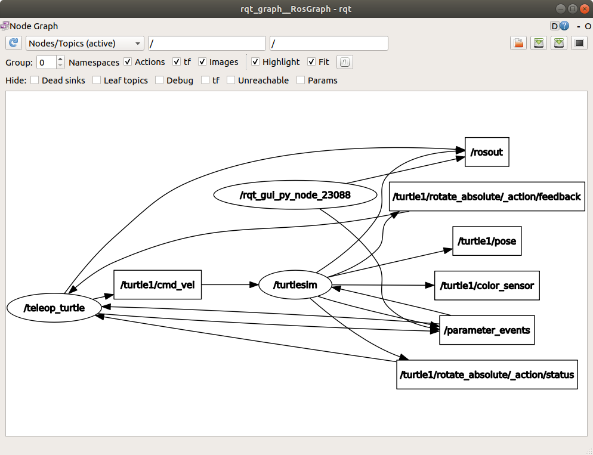

[링크](https://docs.ros.org/en/humble/Tutorials/Beginner-CLI-Tools/Understanding-ROS2-Topics/Understanding-ROS2-Topics.html)


## 목차
1. [Topic이란?](#1-topic이란)
2. [ros2 topic list(= 토픽 정보 확인)](#2-ros2-topic-list-토픽-정보-확인)
3. [ros2 topic echo(=토픽 터미널창 출력)](#3-ros2-topic-echo-토픽-터미널창-출력)
4. [ros2 topic info(=토픽 정보 확인)](#4-ros2-topic-info-토픽-정보-확인)
5. [ros2 interface show(=토픽의 상세 내용 확인)](#5-ros2-interface-show-토픽의-상세-내용-확인)
6. [ros2 topic pub(= 토픽 직접 publishing)](#6-ros2-topic-pub-토픽-직접-publishing)
7. [ros2 topic hz(=토픽의 출력 빈도 확인)](#7-ros2-topic-hz-토픽의-출력-빈도-확인)

---

### 1. Topic이란?

ros2는 복잡한 시스템 → 여러 노드로 break한다(=나눈다)

topic은 ros graph가 동작하기 위한 필수요소
**topic은 node 끼리 메시지를 주고 받기 위한 bus**이다.

node는 **여러 개의 topic을 pulish**할 수 있고 **여러 개의 노드를 subscribe** 할 수 있다

토픽은 nodes 끼리 통신하는 가장 기본 방법이다

### 2. ros2 topic list(= 토픽 정보 확인)

ros2 topic list 명령어를 통해 topic 리스트를 볼 수 있다

ros2 topic list 결과

```bash
/parameter_events
/rosout
/turtle1/cmd_vel
/turtle1/color_sensor
/turtle1/pose
```

ros2 topic list -t 결과

type까지 표시할 수 있다

```bash
/parameter_events [rcl_interfaces/msg/ParameterEvent]
/rosout [rcl_interfaces/msg/Log]
/turtle1/cmd_vel [geometry_msgs/msg/Twist]
/turtle1/color_sensor [turtlesim/msg/Color]
/turtle1/pose [turtlesim/msg/Pose]
```

rqt_graph에서 제대로 보고 싶으면 아래 check box 설정을 따라해라

- 이미지    



### 3. ros2 topic echo(=토픽 터미널창 출력)

```bash
# 형식
ros2 topic echo <topic_name>

# 예시
ros2 topic echo /turtle1/cmd_vel 
```

/teleop_turtle노드가 /turtle1/cmd_vel 토픽을 /turtlesim 노드로 보내는 것을 알고 있으므로 해당 토픽을 echo를 통해 출력할 것이다

rqt_graph에서 /turtle1/cmd_vel 토픽이 
1) echo terminal 노드 2) turtlesim 노드

두개의 노드에 publishing 되는 것을 볼 수 있다

### 4. ros2 topic info(=토픽 정보 확인)

입력

```bash
ros2 topic info /turtle1/cmd_vel
```

결과

```bash
Type: geometry_msgs/msg/Twist
Publisher count: 1
Subscription count: 2
```

### 5. ros2 interface show(=토픽의 상세 내용 확인)

노드는 topic을 사용해서 메시지를 보낸다

publisher와 subscriber는 같은 타입의 메시지를 통해 통신해야한다.

`ros2 topic list -t` 를 통해 `cmd_vel` 타입이

`geometry_msgs/msg/Twist` 인것을 확인 할 수 있었다

아래와 같이 정확한 msg 타입을 출력해 볼 수 있다

입력

```bash
# 형식
ros2 interface show <msg type>

# 예시
ros2 interface show geometry_msgs/msg/Twist 
```

- 결과
    
    ```bash
    # This expresses velocity in free space broken into its linear and angular parts.
    
        Vector3  linear
                float64 x
                float64 y
                float64 z
        Vector3  angular
                float64 x
                float64 y
                float64 z
    ```
    

linear vector 3개와 angular vector 3개 값을 볼 수 있다

### 6. ros2 topic pub(= 토픽 직접 publishing)

```bash
# 형식
ros2 topic pub <topic_name> <msg_type> '<args>'

# 예시1 (--once 옵션으로 1번 전송)
ros2 topic pub --once /turtle1/cmd_vel geometry_msgs/msg/Twist "{linear: {x: 2.0, y: 0.0, z: 0.0}, angular: {x: 0.0, y: 0.0, z: 1.8}}"

# 예시2 (--once 옵션이 빠진 무한 pub)
ros2 topic pub /turtle1/cmd_vel geometry_msgs/msg/Twist "{linear: {x: 2.0, y: 0.0, z: 0.0}, angular: {x: 0.0, y: 0.0, z: 1.8}}"
```

**publishing 옵션**

`--once` : 1번만 전송

`--rate 1` : 1Hz(1초에 1번)로 전송

**publishing 타임스탬프**

topic에 auto 타임스탬프를 채우는 방법은 2가지 있다

1) `std_msg/msg/Header`를 사용하는 경우

헤더 필드를 auto로 세팅한다

(= header: "auto" 로 설정)

```bash
ros2 topic pub /pose geometry_msgs/msg/PoseStamped '{header: "auto", pose: {position: {x: 1.0, y: 2.0, z: 3.0}}}’
```

2) 메시지가 full header를 사용하지 않는 경우(=If the message does not use a full header) `builtin_interfaces/msg/Time` 필드를 가지고 있는 경우 해당 필드를 now로 세팅한다

(=time_ref: "now"로 설정)

```bash
ros2 topic pub /reference sensor_msgs/msg/TimeReference '{header: "auto", time_ref: "now", source: "dumy"}'
```

### 7. ros2 topic hz(=토픽의 출력 빈도 확인)

입력

```bash
ros2 topic hz /turtle1/pose
```

= turtlesim 노드가 publishing하는 pose 토픽의 출력빈도 확인

- 결과
    
    ```bash
    average rate: 59.354
      min: 0.005s max: 0.027s std dev: 0.00284s window: 58
    ```